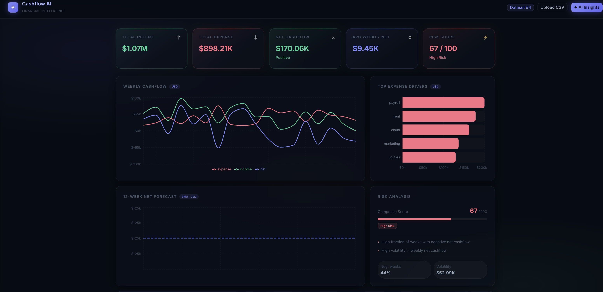
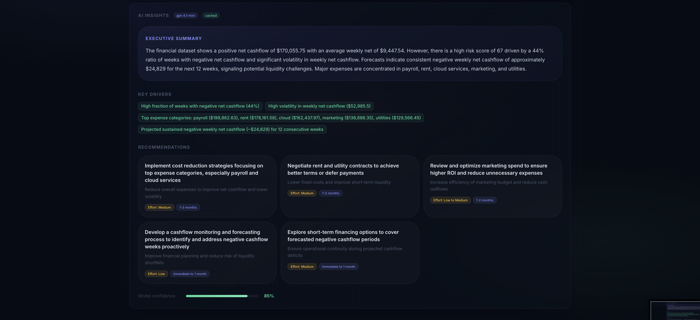

# ◈ Cashflow AI Dashboard

> **AI-powered financial intelligence platform** — deterministic cashflow analytics fused with grounded LLM-generated executive insights.


---

## 📸 Screenshots

### Dashboard Overview


### AI Insights Panel


---

## 🚀 What It Does

Upload a transactions CSV and instantly get:

| Feature | Description |
|---|---|
| **Financial Summary** | Total income, expense, net cashflow, weekly averages |
| **Weekly Cashflow Chart** | Income · Expense · Net trends over time |
| **Top Expense Drivers** | Ranked categories consuming the most cash |
| **12-Week Forecast** | EMA-based net cashflow projection |
| **Risk Score (0–100)** | Volatility + negative-week ratio composite score |
| **AI Executive Summary** | Grounded LLM analysis — no hallucinated numbers |
| **Strategic Recommendations** | Actionable steps with effort, impact, timeframe |

> The system strictly separates **deterministic computation** from **AI reasoning** — the LLM only sees pre-computed facts, never raw transactions.

---

## 🏗 Architecture

```
┌─────────────────────────────────┐
│         Frontend                │
│   React + Vite + MUI + Recharts │
└──────────────┬──────────────────┘
               │ REST (HTTP/JSON)
               ▼
┌─────────────────────────────────┐
│         Backend                 │
│   Spring Boot 4 · Java 17       │
└────┬──────────────┬─────────────┘
     │              │
     ▼              ▼
Analytics        AI Layer
Engine           ───────────────
──────────       AiFacadeService
AnalyticsSvc     @Cacheable
Risk scoring     AiInsightsSvc
EMA forecast     → OpenAI API
                 Rate limiter
     │
     ▼
PostgreSQL
Datasets + Transactions
```

---

## ⚙️ Tech Stack

| Layer | Technology |
|---|---|
| Backend | Spring Boot 4, Java 17 |
| Database | PostgreSQL 16 |
| ORM | Hibernate / JPA |
| HTTP Client | Spring WebFlux WebClient |
| Caching | Caffeine (30-min TTL) |
| Frontend | React 19, Vite, TypeScript |
| UI | MUI v7 (dark theme) |
| Charts | Recharts |
| AI | OpenAI Chat API (`gpt-4.1-mini`) |

---

## 🔧 Backend Setup

**Requirements:** Java 17+, PostgreSQL 16+, Maven

### 1 — Clone & navigate

```bash
git clone <repo-url>
cd cashflow-ai-dashboard/backend
```

### 2 — Set your OpenAI key

```bash
export OPENAI_API_KEY=your_openai_key_here
```

### 3 — Start the backend

```bash
./mvnw spring-boot:run
# → http://localhost:8080
```

> **Database config** is in `src/main/resources/application.yml`. Default: `localhost:5433/cashflow`, user `cashflow`.

---

## 🎨 Frontend Setup

**Requirements:** Node 18+, npm

```bash
cd ../frontend
npm install
npm run dev
# → http://localhost:5173
```

---

## 📡 API Reference

### Upload CSV
```
POST /api/datasets/upload
Content-Type: multipart/form-data

→ { "datasetId": 1 }
```

### Analytics
```
GET  /api/datasets/{id}/summary
GET  /api/datasets/{id}/weekly
GET  /api/datasets/{id}/drivers?limit=5
GET  /api/datasets/{id}/risk
GET  /api/datasets/{id}/forecast?horizon=12
```

### AI Insights *(cached)*
```
POST /api/datasets/{id}/explain?horizon=12
```

---

## 🤖 AI Grounding Strategy

**The core guarantee: the LLM never sees raw transactions.**

```
1. Compute analytics deterministically  →  AnalyticsService
2. Serialize into structured JSON       →  AiFacadeService
3. Send only computed facts to LLM      →  AiInsightsService
4. Require structured JSON response     →  response_format: json_object
5. Cache result per (datasetId:horizon) →  @Cacheable("aiInsights")
```

**Example grounded payload sent to OpenAI:**

```json
{
  "summary": {
    "totalIncome": 1068260.79,
    "totalExpense": 898205.04,
    "netCashflow": 170055.75,
    "avgWeeklyNet": 9447.54
  },
  "risk": { "riskScore": 67 },
  "topExpenseDrivers": [
    { "category": "Payroll", "totalExpense": 199862.63 },
    { "category": "Rent",    "totalExpense": 178161.58 }
  ],
  "forecastWeeklyNet": [
    { "weekStart": "2025-06-23", "projectedNet": -24828.98 }
  ]
}
```

**Example AI response:**

```json
{
  "executiveSummary": "The company shows positive net cashflow but high volatility...",
  "keyDrivers": ["Payroll concentration", "Seasonal revenue dips"],
  "recommendations": [
    {
      "action": "Reduce payroll overhead",
      "impact": "Improve weekly cashflow stability",
      "effort": "Medium",
      "timeframe": "1–3 months"
    }
  ],
  "confidence": 0.9,
  "notes": []
}
```

---

## 🧮 Risk Scoring Model

Risk score (0–100) is a composite of:

- **Negative weeks ratio** → fraction of weeks with net < 0 (weight: 60%)
- **Weekly net volatility** → std deviation relative to mean (weight: 40%)

| Score | Label | Color |
|---|---|---|
| 0–33 | Low Risk | 🟢 Green |
| 34–66 | Medium Risk | 🟡 Amber |
| 67–100 | High Risk | 🔴 Red |

---

## 💾 Caching Strategy

To minimize OpenAI API cost:

- Responses are cached per `(datasetId + horizon)` key
- **First call** → hits OpenAI, stores result in Caffeine cache (30 min TTL)
- **Subsequent calls** → instant response, zero API cost
- Rate limiter enforces 1-second minimum between outbound calls

---

## 🛡 Error Handling

| Scenario | Response |
|---|---|
| Dataset not found | `404 Dataset not found: {id}` |
| Non-CSV file upload | `400 Only CSV files are accepted` |
| OpenAI rate limited | `429 OpenAI rate limit reached` |
| Invalid API key | `401 Invalid OpenAI API key` |
| OpenAI server error | `502 OpenAI service error` |
| Malformed AI response | `500 Failed to parse AI response` |

---

## 📂 Project Structure

```
cashflow-ai-dashboard/
├── backend/
│   └── src/main/java/.../
│       ├── api/
│       │   ├── AiController.java
│       │   ├── AnalyticsController.java
│       │   ├── DatasetController.java
│       │   ├── GlobalExceptionHandler.java
│       │   └── dto/
│       ├── service/
│       │   ├── AiFacadeService.java      ← @Cacheable wrapper
│       │   ├── AiInsightsService.java    ← OpenAI client + rate limiter
│       │   ├── AnalyticsService.java     ← deterministic engine
│       │   └── DatasetIngestionService.java
│       ├── model/
│       ├── repository/
│       └── config/
│           └── CacheConfig.java
├── frontend/
│   └── src/
│       ├── App.tsx     ← MUI dark dashboard
│       └── api.ts      ← axios client
└── README.md
```

---

## 🔮 Future Enhancements

- [ ] Multi-user authentication & dataset ownership
- [ ] Advanced forecasting (ARIMA / Prophet)
- [ ] Anomaly detection on transaction data
- [ ] PDF executive report export
- [ ] Cloud deployment (AWS / GCP / Azure)
- [ ] Real-time streaming updates via WebSocket

---

## 🎯 Project Goal

> Deliver **executive-ready financial analysis** by combining deterministic analytics with AI-generated reasoning — maintaining accuracy, cost efficiency, and architectural clarity.

---

**Author:** Sanskruti Manoria
