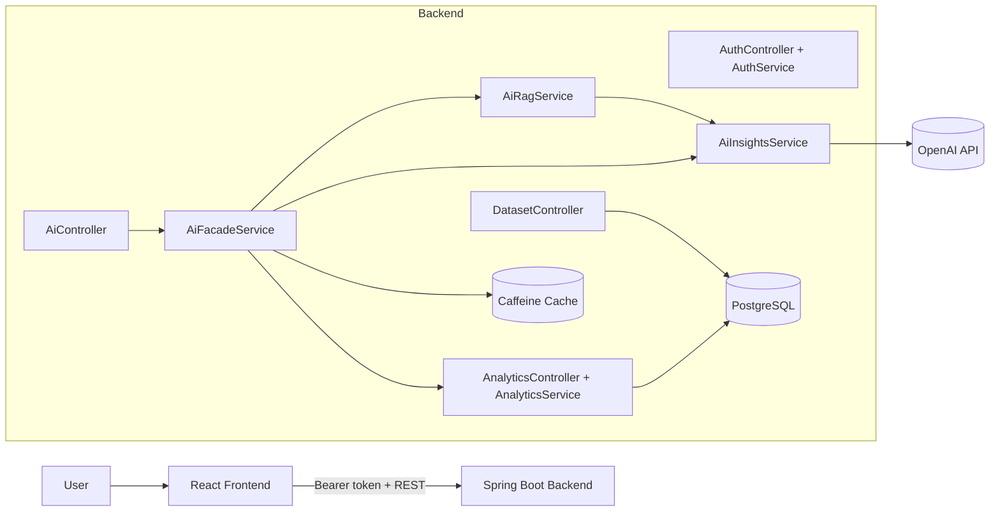
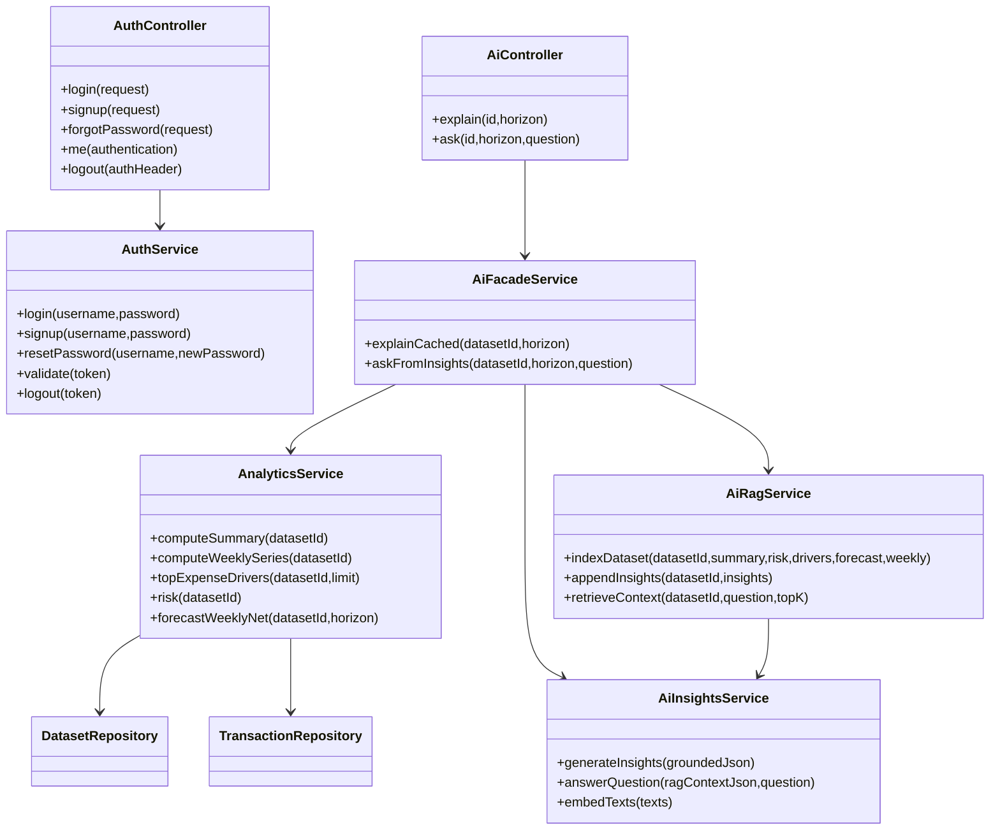
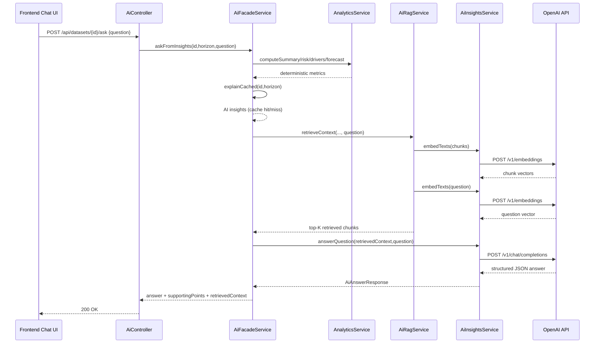

# Cashflow AI Dashboard

AI-first financial intelligence platform that combines deterministic analytics with a grounded RAG + LLM assistant.

## Problem and solution

### Problem

Small businesses and finance teams often struggle with cashflow visibility because:

- Transaction data is scattered and hard to interpret quickly.
- Forecasting and risk assessment are usually manual and inconsistent.
- Traditional dashboards show metrics but do not answer executive \"why\" and \"what should we do next\" questions.
- Generic AI chat tools can hallucinate if they are not grounded in business data.

### Solution (this app)

Cashflow AI Dashboard solves this by combining analytics engineering + applied AI:

- Ingests raw CSV transaction data into a structured dataset.
- Computes deterministic financial signals (summary, drivers, risk, forecast).
- Generates grounded AI insights from those computed facts.
- Provides a RAG chatbot that retrieves relevant context before LLM answering.
- Exposes supporting points + retrieved context for explainable answers.
- Adds speech-to-text interaction so users can query insights naturally.

This app is not just "chat over data". It implements a clear AI pipeline:

1. Deterministic analytics from transactional data
2. AI insight generation from grounded analytics facts
3. Retrieval-Augmented Generation (RAG) for Q&A over generated insights + computed metrics
4. Speech-to-text UX for natural querying

The assistant answers with retrieved context, not free-form model memory.

---

## Core capabilities

- CSV ingestion for transaction datasets
- Deterministic KPI analytics:
  - Total income / expense / net
  - Weekly series
  - Top expense drivers
  - Risk score (0–100)
  - 12-week EMA forecast
- AI Insights generation (`/explain`) with caching
- RAG Chatbot (`/ask` and `/chat`) grounded on analytics + insights
- Speech-to-text chat input (browser Web Speech API)
- Auth-protected API with token-based session flow
- Multi-step auth UI:
  - Sign in
  - Sign up
  - Forgot password (reset)
- Dark/light theme toggle in top header
- Two-tab home experience:
  - `Dashboard` tab (KPIs, charts, AI insights, chatbot)
  - `Transactions` tab (search + filter + pagination + row edit/delete)
- Transaction workbench:
  - Server-side pagination (20 rows/page)
  - Search by description/category/type
  - Filter by type and category
  - Row detail popup with description edit, save, delete

---

## Tech stack

### Backend

- Java 17
- Spring Boot 4
- Spring MVC + WebFlux WebClient
- Spring Security (token-based auth filter)
- Spring Cache + Caffeine
- PostgreSQL + Spring Data JPA
- OpenAI APIs:
  - Chat Completions (insights and final answers)
  - Embeddings (retrieval for RAG)

### Frontend

- React 19 + TypeScript + Vite
- MUI v7
- Recharts
- Axios
- Web Speech API (`SpeechRecognition` / `webkitSpeechRecognition`)

---

## High-level architecture (Mermaid)


```mermaid
flowchart LR
    U[User] --> FE[React Frontend]
    FE -->|Bearer token + REST| BE[Spring Boot Backend]

    subgraph Backend
      AUTH[AuthController + AuthService]
      DATASET[DatasetController]
      ANALYTICS[AnalyticsController + AnalyticsService]
      AI[AiController]
      FACADE[AiFacadeService]
      RAG[AiRagService]
      OPENAI[AiInsightsService]
      CACHE[(Caffeine Cache)]
      DB[(PostgreSQL)]

      DATASET --> DB
      ANALYTICS --> DB
      AI --> FACADE
      FACADE --> ANALYTICS
      FACADE --> CACHE
      FACADE --> RAG
      RAG --> OPENAI
      FACADE --> OPENAI
    end

    OPENAI --> OAI[(OpenAI API)]
```

---

## Backend communication flow for AI (detailed)

### A) Insights generation (`POST /api/datasets/{id}/explain`)

1. `AiController.explain()` receives request.
2. `AiFacadeService.explainCached(datasetId, horizon)` orchestrates:
   - `computeSummary()`
   - `risk()`
   - `topExpenseDrivers()`
   - `forecastWeeklyNet()`
3. Facade serializes grounded payload JSON.
4. `AiInsightsService.generateInsights()` calls OpenAI Chat Completions.
5. Response is parsed into strict JSON DTO (`AiInsightsResponse`).
6. Result cached by key `datasetId:horizon`.

### B) RAG chatbot (`POST /api/datasets/{id}/ask`)

1. `AiController.ask()` receives question.
2. `AiFacadeService.askFromInsights()` tries retrieval first.
3. If chunks are missing, service auto-attempts indexing via `AiRagService.indexDataset()` using:
   - summary metrics
   - risk score + reasons
   - expense drivers
   - forecast trend
   - weekly aggregates
   - sampled transactions
4. Retrieval:
   - vector mode if pgvector is available
   - lexical fallback mode if pgvector is unavailable
   - embed chunks (`/v1/embeddings`) in vector mode
   - embed question
   - cosine similarity ranking
   - top-K chunk selection
5. Retrieved chunks are passed to `AiInsightsService.answerQuestion()`.
6. LLM returns structured answer + supporting points.
7. API returns:
   - `answer`
   - `supportingPoints`
   - `retrievedContext`
   - `method: "RAG+LLM"`

This is retrieval-first generation with graceful lexical fallback.

---

## UML diagrams

### 1) Class diagram (key AI/auth components)


```mermaid
classDiagram
    class AuthController {
      +login(request)
      +signup(request)
      +forgotPassword(request)
      +me(authentication)
      +logout(authHeader)
    }

    class AuthService {
      +login(username,password)
      +signup(username,password)
      +resetPassword(username,newPassword)
      +validate(token)
      +logout(token)
    }

    class AiController {
      +explain(id,horizon)
      +ask(id,horizon,question)
    }

    class AiFacadeService {
      +explainCached(datasetId,horizon)
      +askFromInsights(datasetId,horizon,question)
    }

    class AiRagService {
      +indexDataset(datasetId,summary,risk,drivers,forecast,weekly)
      +appendInsights(datasetId,insights)
      +retrieveContext(datasetId,question,topK)
    }

    class AiInsightsService {
      +generateInsights(groundedJson)
      +answerQuestion(ragContextJson,question)
      +embedTexts(texts)
    }

    class AnalyticsService {
      +computeSummary(datasetId)
      +computeWeeklySeries(datasetId)
      +topExpenseDrivers(datasetId,limit)
      +risk(datasetId)
      +forecastWeeklyNet(datasetId,horizon)
    }

    class DatasetRepository
    class TransactionRepository

    AuthController --> AuthService
    AiController --> AiFacadeService
    AiFacadeService --> AnalyticsService
    AiFacadeService --> AiInsightsService
    AiFacadeService --> AiRagService
    AiRagService --> AiInsightsService
    AnalyticsService --> DatasetRepository
    AnalyticsService --> TransactionRepository
```

### 2) Sequence diagram for chatbot request


```mermaid
sequenceDiagram
    participant UI as Frontend Chat UI
    participant AIC as AiController
    participant F as AiFacadeService
    participant AN as AnalyticsService
    participant R as AiRagService
    participant O as AiInsightsService
    participant OA as OpenAI API

    UI->>AIC: POST /api/datasets/{id}/ask {question}
    AIC->>F: askFromInsights(id,horizon,question)

    F->>AN: computeSummary/risk/drivers/forecast
    AN-->>F: deterministic metrics

    F->>F: explainCached(id,horizon)
    F-->>F: AI insights (cache hit/miss)

    F->>R: retrieveContext(..., question)
    R->>O: embedTexts(chunks)
    O->>OA: POST /v1/embeddings
    OA-->>O: chunk vectors
    R->>O: embedTexts(question)
    O->>OA: POST /v1/embeddings
    OA-->>O: question vector
    R-->>F: top-K retrieved chunks

    F->>O: answerQuestion(retrievedContext,question)
    O->>OA: POST /v1/chat/completions
    OA-->>O: structured JSON answer
    O-->>F: AiAnswerResponse
    F-->>AIC: answer + supportingPoints + retrievedContext
    AIC-->>UI: 200 OK
```

---

## Security architecture

- Public auth routes:
  - `POST /api/auth/login`
  - `POST /api/auth/signup`
  - `POST /api/auth/forgot-password`
- All `/api/**` business endpoints require Bearer token.
- Custom filter (`BearerTokenAuthFilter`) validates in-memory session tokens.
- `AuthService` manages token issuance, validation, expiry, and logout.

---

## API reference

### Auth

- `POST /api/auth/login`
- `POST /api/auth/signup`
- `POST /api/auth/forgot-password`
- `GET /api/auth/me`
- `POST /api/auth/logout`

### Dataset + analytics

- `POST /api/datasets/upload`
- `GET /api/datasets/{id}/summary`
- `GET /api/datasets/{id}/weekly`
- `GET /api/datasets/{id}/drivers?limit=5`
- `GET /api/datasets/{id}/risk`
- `GET /api/datasets/{id}/forecast?horizon=12`
- `GET /api/datasets/{id}/transactions?page=0&size=20&search=&type=&category=`
- `GET /api/datasets/{id}/transactions/categories`
- `PUT /api/datasets/{id}/transactions/{transactionId}`
- `DELETE /api/datasets/{id}/transactions/{transactionId}`

### AI

- `POST /api/datasets/{id}/explain?horizon=12`
- `POST /api/datasets/{id}/ask?horizon=12`
- `POST /api/datasets/{id}/chat?horizon=12` (alias)

---

## Project structure

```text
cashflow-ai-dashboard/
├── backend/
│   └── src/main/java/com/sanskruti/cashflow/cashflow_backend/
│       ├── api/
│       │   ├── AuthController.java
│       │   ├── DatasetController.java
│       │   ├── AnalyticsController.java
│       │   ├── AiController.java
│       │   └── dto/
│       ├── service/
│       │   ├── AuthService.java
│       │   ├── AnalyticsService.java
│       │   ├── AiFacadeService.java
│       │   ├── AiInsightsService.java
│       │   ├── AiRagService.java
│       │   └── DatasetIngestionService.java
│       ├── config/
│       │   ├── SecurityConfig.java
│       │   ├── BearerTokenAuthFilter.java
│       │   ├── AuthProperties.java
│       │   ├── CacheConfig.java
│       │   └── CorsConfig.java
│       ├── model/
│       └── repository/
├── frontend/
│   ├── src/
│   │   ├── App.tsx
│   │   └── api.ts
│   ├── public/
│   └── index.html
└── README.md
```

---

## Local setup

## 1) Backend

```bash
cd backend
# Optional: set only if you want AI insights/chat to call OpenAI
export OPENAI_API_KEY=your_openai_key
./mvnw spring-boot:run
```

Default backend URL: `http://localhost:8080`

Database expected by default:

- host: `localhost`
- port: `5433`
- db: `cashflow`
- user/pass: `cashflow` / `cashflow`

## 2) Frontend

```bash
cd frontend
npm install
npm run dev
```

Frontend URL: `http://localhost:5173`

---

## Demo flow

1. Login with demo credentials (`demo@cashflow.ai` / `password123`) or create account using Sign up.
2. Upload CSV.
3. Explore Dashboard tab (KPIs, charts, risk, forecast).
4. Open Transactions tab for search/filter/pagination.
5. Click any row to edit description or delete.
6. Generate AI insights.
7. Ask chatbot question (typed or via mic).

---

## AI concepts used

- Retrieval-Augmented Generation (RAG)
- Embedding-based semantic search
- Cosine similarity ranking
- Grounded generation from deterministic features
- Structured output enforcement (JSON contracts)
- Prompt constraints against hallucination
- Cache-aware AI orchestration

---

## Future upgrades

- Persistent vector store (pgvector / Milvus) instead of on-request embedding
- Per-user chat memory with trace IDs, Google Auth login
- Tool calling for scenario simulation and what-if planning
- Streaming token responses for chat UX
- Automated evaluation set for answer faithfulness

---

Author: Sanskruti Manoria
